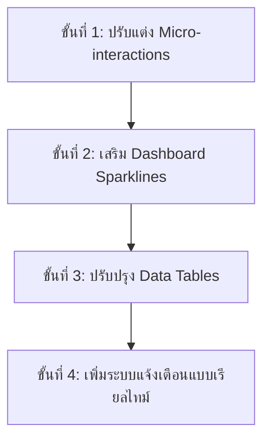

# 🧺 คู่มือมาตรฐานการพัฒนาและวิเคราะห์ UX/UI (Admin Dashboard Skill)
## โครงการ: ใส่ใจผ้าเรียบ (SaiJai Phareab) — ระบบจัดการหลังบ้านพรีเมียม

> [!NOTE]
> เอกสารนี้ทำหน้าที่เป็น **"Skill & UX/UI Review Document"** ประจำโปรเจกต์ เพื่อสร้างแนวทางปฏิบัติร่วมกัน (Developer Guidelines) ในการขยายและปรับปรุงหน้าแผงควบคุมผู้ดูแลระบบ (Admin/Employee Dashboard) ด้วยเทคโนโลยี Nuxt 4, Nuxt UI และ Tailwind CSS v4

---

## 🚀 1. บทวิเคราะห์และตรวจสอบ UX/UI (Admin UX/UI Review)

จากการวิเคราะห์โค้ดปัจจุบันใน `app/pages/admin/index.vue`, `app/layouts/admin.vue` และชุดการกำหนดค่าใน `shared/config/adminUi.ts` สรุปผลลัพธ์การรีวิวได้ดังนี้:

### 👍 จุดเด่นทางดีไซน์ (Strengths)
1. **การใช้ Tokens ร่วมกันอย่างเป็นระบบ (Unified Tokens)**:
   - มีการรวมศูนย์ CSS classes ไว้ใน [adminUi.ts](file:///c:/Users/Admin/Desktop/work/Github/SaiJai-Phareab/shared/config/adminUi.ts) เช่น `adminDashboardBodyClass`, `adminMetricCardClass` และ `adminTableUi`
   - ช่วยลดความกระจัดกระจายของโค้ดและทำให้การอัปเกรดดีไซน์ในอนาคตทำได้ทันทีจากที่เดียว
2. **Shopee-style Refined & Modern Palette**:
   - เลือกใช้ดีไซน์โค้งมนพอเหมาะ (`rounded-md`), เงาฟุ้งเบาบาง (`shadow-[0_1px_2px...]`), และขอบเขตสีที่สะอาดตา ปราศจากสีที่จัดจ้านเกินไป
   - ใช้โทนสีแบรนด์ฟ้า-น้ำเงินพรีเมียม (Sky/Cyan/Indigo) ซึ่งเข้ากันได้ดีกับอัตลักษณ์ของร้านซักรีดที่เน้นความสะอาดสะอ้านและใส่ใจ
3. **การออกแบบเชิงรับ (Responsive Layout)**:
   - หน้า Layout มี Sidebar ที่ยุบได้ (`collapsible`) และปรับขนาดได้ (`resizable`)
   - รองรับการใช้งานผ่าน Mobile-first ด้วย Drawer และ fallback skeleton สำหรับสถานะการดาวน์โหลดข้อมูล

### ⚠️ จุดที่สามารถพัฒนาต่อได้ (Opportunities for Improvement)
1. **การจัดการโหลดข้อมูล (Skeleton & Loading States)**:
   - ปัจจุบันมีการใช้ `<ClientOnly>` และ fallback เป็นแผงปุ่ม skeleton
   - สามารถเพิ่มการทำ transition นุ่มนวล (Fade-in/Smooth transition) เมื่อสลับระหว่างข้อมูลที่โหลดเสร็จและโหลดจริง เพื่อป้องกัน Layout Shift บนอุปกรณ์พกพา
2. **การตอบสนองแบบทันท่วงที (Micro-interactions)**:
   - ควรเพิ่มสถานะ Active, Hover และ Focus ที่เด่นชัดขึ้นในส่วนของลิงก์ย่อยด้านซ้าย (Sidebar)
   - ปรับปรุงการกดรีเฟรชข้อมูล (`handleRefresh`) ให้มีไอคอนหมุนแบบนุ่มนวลและปุ่มกดล็อกสถานะชั่วคราวเพื่อป้องกันการกดเบิ้ล (Debouncing)
3. **การเข้าถึงข้อมูลและการจัดกลุ่ม (Data Density & Hierarchy)**:
   - ข้อมูลการ์ด Metric ตัวเลข 4 ใบหลักในหน้า Dashboard สามารถเพิ่มกราฟ Trend Line เล็กๆ ด้านล่าง (Sparklines) เพื่อให้แอดมินเห็นทิศทางยอดขายและจำนวนผ้าที่รับเข้ามาในแต่ละวันได้อย่างรวดเร็ว

---

## 🎨 2. โทนสีและสไตล์ชีทพรีเมียม (Premium Palette & UI System)

สไตล์ชีทหลักอิงตามค่าดีไซน์โทนสีในระบบ ดังนี้:

* **สีพื้นหลังหลัก**: `bg-default` (สว่าง) / `bg-elevated` (มืด) ให้ความรู้สึกนุ่มนวลและกระจายแสงได้ดี
* **กรอบและเส้นขอบ (Borders)**: ใช้ความเข้มต่ำ `border-default/30` และ `dark:border-default/20` เพื่อลดมลภาวะทางสายตา
* **ระบบเงาพรีเมียม (Premium Shadows)**:
  - ใช้ Soft Shadow ไล่ระดับเพื่อเน้นมิติความลึก (Depth) ให้แก่หน้าจอ:
  ```css
  shadow-[0_1px_2px_rgb(15_23_42/0.04),0_6px_18px_-10px_rgb(15_23_42/0.08)]
  ```

---

## 🛠️ 3. แผนการจัดทำและพัฒนาหน้าจอแผงควบคุม (Next-Phase Implementation Plan)

เพื่อพัฒนา UX/UI ของหน้าจอผู้ดูแลระบบขึ้นไปอีกระดับ ทีมพัฒนาควรดำเนินงานตามแผน 4 ขั้นตอนดังต่อไปนี้:



### 📅 ลำดับขั้นตอนการดำเนินงาน (Phasing)

#### 🔹 เฟสที่ 1: เสริมพลังงานการโต้ตอบแบบนุ่มนวล (Micro-interactions & UX Polish)
- เพิ่มเอฟเฟกต์หมุน 360 องศาให้ปุ่มรีเฟรช (`i-lucide-refresh-cw`) เมื่อกำลังดึงข้อมูลใหม่
- เพิ่ม Skeleton placeholder ที่มีขนาดและอัตราส่วนตรงกับ Component ข้อมูลจริงทุกจุด (เช่น ตารางยอดขาย ตารางรายการรับผ้า)

#### 🔹 เฟสที่ 2: เพิ่มการแสดงผลข้อมูลแบบสรุปประสิทธิภาพสูง (High-fidelity Visuals)
- พัฒนา Sparkline หรือกราฟเทรนด์ขนาดเล็กฝังลงในการ์ด Metrics ทั้ง 4 ตัวของหน้าหลัก
- ใช้ประโยชน์จากไลบรารี `@unovis/vue` ที่ติดตั้งในระบบอยู่แล้วเพื่อสร้างกราฟพรีเมียมสีฟ้าคราม

#### 🔹 เฟสที่ 3: พัฒนาระบบกรองข้อมูลแบบเรียลไทม์ (Superb Filter & Analytics)
- ออกแบบระบบ Toolbar กรองช่วงวันที่ (`DateRangePicker`) และประเภทรายการบริการที่ยืดหยุ่นขึ้น
- เพิ่มปุ่มลัด (Quick Presets) เช่น "วันนี้", "เมื่อวาน", "7 วันที่ผ่านมา", "เดือนนี้" เพื่ออำนวยความสะดวกให้ผู้ใช้งานระดับผู้จัดการร้าน

---

## 📝 4. แนวทางการเขียนโค้ดและพัฒนา (Developer Code Guidelines)

ในการเขียนโค้ดเพิ่มเติมในโฟลเดอร์ `app/pages/admin/` หรือส่วนติดต่อผู้ใช้งานอื่นๆ ให้ผู้พัฒนาปฏิบัติตามกฎเหล็กเหล่านี้:

1. **ห้ามใช้ Inline Utility Tailwind สำหรับสีและขอบโค้งอย่างกระจัดกระจาย**:
   - **ผิด❌**: `<div class="rounded-lg shadow-md border border-gray-200 bg-white">`
   - **ถูก✅**: `<div :class="adminDashboardCardClass">` (นำเข้าคลาสจาก `~~/shared/config/adminUi`)
2. **รักษาความสมบูรณ์ในการรองรับ Dark Mode**:
   - ทุกๆ การกำหนดสีตัวอักษรหรือพื้นหลัง ต้องแนบค่าฝั่ง `dark:` เสมอ เช่น `text-toned dark:text-muted` หรืออาศัย CSS variables หลักของ Nuxt UI
3. **การทำ Loading State ที่ไร้รอยต่อ**:
   - เมื่อใช้ `<ClientOnly>` ให้ใส่ `#fallback` ที่มีหน้าตา ขนาด และการวางโครงสร้างเกือบเทียบเท่าของจริง (ใช้ `animate-pulse` ร่วมกับ `USkeleton`) เสมอเพื่อสร้างความลื่นไหลระดับสูงให้กับเว็บแอปพลิเคชัน
