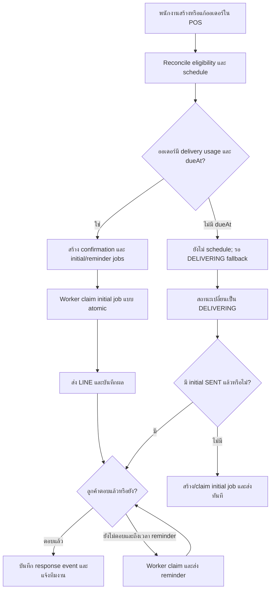

# แผนระบบยืนยันการรับผ้ารอบถัดไป

สถานะเอกสาร: พร้อมใช้เป็น implementation brief ยังไม่มีการแก้ application code
ปรับปรุงล่าสุด: 9 สิงหาคม 2569

## 1. เป้าหมายและขอบเขต

ก่อนนำผ้าสะอาดของออเดอร์ที่ใช้แพ็กเกจรับ–ส่งไปคืนลูกค้า ระบบถามผ่าน LINE ว่าลูกค้ามีผ้ารอบถัดไปให้รับกลับมาหรือไม่ และส่งคำตอบให้เจ้าของร้านกับพนักงานที่สมัครรับการแจ้งเตือน

คำตอบที่รองรับ:

1. มีผ้าส่งซัก
2. นำผ้ามาส่งที่ร้านเอง
3. ไม่มีผ้ารอบนี้
4. ขอเลื่อน / ติดต่อร้าน

คำตอบเป็นข้อมูล logistics เท่านั้น ระบบต้องไม่สร้าง `ServiceOrder`, ไม่เปลี่ยนสถานะออเดอร์ และไม่ตัดเครดิต เมื่อได้รับผ้าจริง พนักงานสร้างออเดอร์ใหม่และเลือกแพ็กเกจเสริมผ่าน POS ตาม flow เดิม

## 2. แนวทางที่เลือก

ใช้ **order-driven hybrid flow**:

- `dueAt` เป็นแหล่งกำหนดวันที่ส่งและเวลาส่งข้อความล่วงหน้า
- scheduled worker ส่ง initial และ reminder ตามค่าที่แอดมินกำหนด
- การเปลี่ยนสถานะเป็น `DELIVERING` เป็น fallback หาก initial ยังไม่ถูกส่ง
- confirmation ผูกกับ `ServiceOrder` และไม่เก็บ `customerId`/`entitlementId` ซ้ำ
- ตรวจว่าเป็นบริการรับ–ส่งจาก snapshot บน `ServiceOrderAddonUsage` ของออเดอร์ ไม่ตรวจเพียงว่าลูกค้ามีแพ็กเกจอยู่

ไม่ใช้ `DELIVERING` เป็น trigger เดียว เพราะพนักงานอาจเปลี่ยนสถานะก่อนออกส่งเพียงไม่กี่นาที แต่ไม่ใช้ scheduled task ตาม entitlement แบบแยกจากออเดอร์ เพราะจะถามลูกค้าโดยไม่มีงานส่งผ้าจริง

## 3. Flow หลัก



ทุก entry point เรียก domain utilities ชุดเดียวกัน:

```text
reconcilePickupConfirmation(serviceOrderId, now)
dispatchDuePickupNotifications(now)
recordPickupResponse(webhookEvent)
```

## 4. การตั้งค่าจากหน้าแอดมิน

เพิ่มส่วน **ยืนยันการรับผ้ารอบถัดไป** ใน `/admin/settings/notification` ซึ่งมี `NotificationSetting` และการเลือก notification subscribers อยู่แล้ว

ค่าเริ่มต้น:

| รายการ | วันก่อน `dueAt` | เวลา Asia/Bangkok | เงื่อนไข |
| --- | ---: | ---: | --- |
| Initial | 1 วัน | 12:15 | ออเดอร์เข้าเกณฑ์และยังไม่เคยส่ง |
| Reminder | 0 วัน | 12:15 | initial ส่งแล้วและลูกค้ายังไม่ตอบ |

“1 วันก่อน” คือวันตามปฏิทิน ไม่ใช่ลบ 24 ชั่วโมง เช่น `dueAt` วันที่ 10 สิงหาคม 09:00 จะตั้ง initial วันที่ 9 สิงหาคม 12:15

แอดมินกำหนดได้:

- เปิด/ปิดระบบ
- จำนวนวันล่วงหน้าและเวลาของ initial
- เปิด/ปิด reminder
- จำนวนวันล่วงหน้าและเวลาของ reminder
- ระยะเวลาเตรียมงานขั้นต่ำก่อน `dueAt`
- subscriber คนใดรับการแจ้งคำตอบของลูกค้า

เสนอ schema:

```prisma
model NotificationSetting {
  // fields เดิม
  pickupConfirmationEnabled            Boolean @default(true)
  pickupInitialDaysBefore               Int     @default(1)
  pickupInitialTime                     String  @default("12:15") @db.VarChar(5)
  pickupReminderEnabled                 Boolean @default(true)
  pickupReminderDaysBefore              Int     @default(0)
  pickupReminderTime                    String  @default("12:15") @db.VarChar(5)
  pickupMinimumLeadMinutes              Int     @default(120)
}

model NotificationSubscriber {
  // fields เดิม
  receivePickupResponse Boolean @default(true)
}
```

เวลาแจ้งเตือนใช้สัญญาเดียวกันตั้งแต่ฐานข้อมูล, API และ UI เป็น local wall-clock time รูปแบบ `HH:mm` เช่น `"12:15"` โดยมี timezone คงที่ `Asia/Bangkok` ห้ามแสดงหรือรับค่าจำนวนนาทีหลังเที่ยงคืนจากผู้ใช้ เพราะอ่านยากและเพิ่มโอกาสตั้งค่าผิด

migration เพิ่ม database `CHECK` constraint ให้ทั้งสองช่องตรง `HH:mm` ที่ถูกต้องด้วย เพื่อไม่ให้ข้อมูลที่ข้าม API หรือข้อมูลจาก script หลุดเข้าไปในรูปแบบอื่น

หน้าแอดมินใช้ `UInput` ที่ `type="time"` และปุ่ม **บันทึกการตั้งค่า** สำหรับ section นี้ ไม่ autosave ทีละ field เพราะ initial, reminder และระยะเวลาเตรียมงานต้อง validate ร่วมกัน แสดง preview ใต้ form เช่น **ระบบจะถามก่อนวันนัด 1 วัน เวลา 12:15 น. และเตือนซ้ำวันนัดเวลา 12:15 น.**

`pickupMinimumLeadMinutes` เป็นค่าระยะเวลา ไม่ใช่เวลาบนนาฬิกา จึงยังเก็บเป็นนาทีเพื่อคำนวณได้ แต่ UI ห้ามให้กรอกเลขนาทีอิสระ ให้เลือกค่าที่เข้าใจง่าย เช่น `30 นาที`, `1 ชั่วโมง`, `2 ชั่วโมง`, `3 ชั่วโมง`, `6 ชั่วโมง` แล้วส่งค่าที่กำหนดไว้ไป API

API ต้อง validate:

- days before เป็นจำนวนเต็ม `0–30`
- time ต้องตรงรูปแบบ 24 ชั่วโมง `HH:mm` ที่ canonical เท่านั้น (`00:00`–`23:59`); reject ค่าว่าง, วันที่, timezone offset และรูปแบบย่อ เช่น `9:5`
- แปลง `HH:mm` เป็น hour/minute ด้วย utility กลางหลัง validation เท่านั้น ห้ามพึ่ง `new Date("1970-01-01T" + time)` หรือ parser ของ runtime
- minimum lead ต้องเป็นหนึ่งในค่าที่ระบบรองรับและอยู่ในช่วง `0–1440` นาที
- initial ต้องถูกกำหนดก่อน reminder เมื่อเทียบเป็นเวลาจริง
- PUT ต้องรับและบันทึก fields เดิมกับ fields ใหม่โดยไม่ทำค่าอื่นสูญหาย
- เฉพาะ `ADMIN` แก้ settings และ subscriber preferences ได้

เมื่อ settings เปลี่ยน ให้ reconcile เฉพาะ jobs ที่ยัง `PENDING`/`FAILED`; ห้ามส่งข้อความที่เลยเวลาให้ทุกออเดอร์ย้อนหลังทันที และห้ามเปลี่ยน jobs ที่ `SENT` แล้ว

## 5. นิยาม `dueAt` และการคำนวณเวลา

สำหรับออเดอร์ที่มี delivery usage ให้ `dueAt` หมายถึงเวลานัดนำผ้าสะอาดส่งถึงลูกค้า ส่วนออเดอร์รับที่ร้านยังคงใช้ความหมายวันพร้อมรับ

UI ควรเปลี่ยน label ตาม fulfillment:

- มี delivery usage: **วันนัดส่งถึงลูกค้า**
- ไม่มี delivery usage: **วันนัดรับที่ร้าน**

คำนวณใน `Asia/Bangkok` ด้วย utility กลางเพียงจุดเดียว แล้วเก็บ `DateTime` เป็น UTC ในฐานข้อมูล

### Initial

```text
configuredInitialAt = วันที่ของ dueAt - initialDaysBefore ที่ pickupInitialTime ใน Asia/Bangkok
```

- worker ส่งเมื่อ `scheduledFor <= now` และ `now < dueAt`
- ถ้าสร้าง/แก้ออเดอร์หลัง `configuredInitialAt` แต่ `dueAt` ยังอยู่ในอนาคต ให้ตั้ง initial เป็น `now` เพื่อส่งใน worker รอบถัดไป ไม่ต้องรอ `DELIVERING`
- ถ้าเข้า `DELIVERING` และ initial ยังไม่ `SENT` ให้ fallback ส่งทันที
- หากออเดอร์เสร็จหรือยกเลิกแล้ว ไม่ส่ง

### Reminder

```text
configuredReminderAt = วันที่ของ dueAt - reminderDaysBefore ที่ pickupReminderTime ใน Asia/Bangkok
latestUsefulReminderAt = dueAt - minimumLeadMinutes
effectiveReminderAt = min(configuredReminderAt, latestUsefulReminderAt)
```

- ส่งเมื่อ initial เป็น `SENT`, ยังไม่มี response และ reminder ยังไม่ `SENT`
- ถ้า `effectiveReminderAt <= initialSentAt` ให้ข้าม reminder เป็น `SKIPPED_TOO_LATE`
- ไม่ส่งเมื่อ `now >= dueAt`, ออเดอร์ `COMPLETED`/`CANCELLED` หรือ confirmation ปิดแล้ว
- ค่า default 12:15 ของวันส่งจึงยังใช้กับรอบบ่าย แต่รอบเช้าจะถูกเลื่อนให้มาก่อน `dueAt` ตาม minimum lead โดยอัตโนมัติ
- การไม่ตอบแสดงเป็น `NO_RESPONSE` ใน UI แต่ไม่บันทึกเป็น response enum และไม่ตีความว่า “ไม่มีผ้า”

worker ควรรันทุก 5 นาที เวลาอาจคลาดจากค่าที่ตั้งได้ไม่เกินหนึ่ง worker interval

## 6. Eligibility ที่เป็น source of truth

ออเดอร์เข้าเกณฑ์เมื่อผ่านทั้งหมด:

- ไม่ใช่ walk-in และไม่ถูก soft-delete
- สถานะเป็น `RECEIVED`, `PROCESSING` หรือ `DELIVERING`
- มี `ServiceOrderAddonUsage` ที่ `isDelivery = true`, credits มากกว่า 0 และยังไม่ถูก refund
- ลูกค้า active, ไม่ถูก soft-delete และเปิด `lineNotifyEnabled`
- ลูกค้ามี Better Auth account ที่ `providerId = "line"`
- `pickupConfirmationEnabled = true`

เพิ่ม snapshot ลง normalized usage:

```prisma
model ServiceOrderAddonUsage {
  // fields เดิม
  isDelivery Boolean @default(false)
}
```

ตอนสร้างหรือแก้ออเดอร์ ต้อง select `PackageProduct.isDelivery` และบันทึกลง usage พร้อม `productId`, `productName` และ `deductOn` เพื่อให้ความหมายของออเดอร์ไม่เปลี่ยนตาม catalog/entitlement ในอนาคต

migration ต้อง backfill usage เดิมจาก `memberEntitlement.product.isDelivery` หรือ `productId` เท่าที่หาได้; แถวที่พิสูจน์ไม่ได้ให้คง `false` และรายงานจำนวนเพื่อให้ตรวจด้วยคน

## 7. แบบจำลองข้อมูล

```prisma
enum PickupConfirmationResponse {
  HOME_PICKUP
  SELF_DROPOFF
  SKIP
  CONTACT_REQUESTED
}

enum PickupConfirmationStatus {
  ACTIVE
  CLOSED
  CANCELLED
}

enum PickupNotificationKind {
  INITIAL
  REMINDER
}

enum PickupNotificationStatus {
  PENDING
  PROCESSING
  SENT
  FAILED
  UNREACHABLE
  SKIPPED_TOO_LATE
  CANCELLED
}

model PickupConfirmation {
  id             String                   @id @default(cuid())
  serviceOrderId String                   @unique
  serviceOrder   ServiceOrder             @relation(fields: [serviceOrderId], references: [id])
  revision       Int                      @default(1)
  status         PickupConfirmationStatus @default(ACTIVE)
  response       PickupConfirmationResponse?
  respondedAt    DateTime?
  responseCount  Int                      @default(0)
  closedAt       DateTime?
  createdAt      DateTime                 @default(now())
  updatedAt      DateTime                 @updatedAt

  notifications PickupConfirmationNotification[]
  responseEvents PickupConfirmationResponseEvent[]
}

model PickupConfirmationNotification {
  id                  String                   @id @default(cuid())
  confirmationId      String
  confirmation        PickupConfirmation       @relation(fields: [confirmationId], references: [id], onDelete: Cascade)
  revision            Int
  kind                PickupNotificationKind
  recipientUserId     String
  scheduledFor        DateTime
  status              PickupNotificationStatus @default(PENDING)
  claimedAt           DateTime?
  claimExpiresAt      DateTime?
  sentAt              DateTime?
  attempts            Int                      @default(0)
  lastError           String?
  createdAt           DateTime                 @default(now())
  updatedAt           DateTime                 @updatedAt

  @@unique([confirmationId, revision, kind])
  @@index([status, scheduledFor])
  @@index([claimExpiresAt])
}

model PickupConfirmationResponseEvent {
  id                  String                     @id @default(cuid())
  confirmationId      String
  confirmation        PickupConfirmation         @relation(fields: [confirmationId], references: [id], onDelete: Cascade)
  revision            Int
  webhookEventId      String                     @unique
  response            PickupConfirmationResponse
  respondedByLineId   String
  createdAt           DateTime                   @default(now())
  staffNotifiedAt     DateTime?
  staffNotifyAttempts Int                        @default(0)
  staffNotifyError    String?

  @@index([confirmationId, createdAt])
  @@index([staffNotifiedAt, createdAt])
}
```

ไม่เก็บ `customerId` หรือ `entitlementId` ซ้ำใน confirmation การตรวจ ownership ใช้ `confirmation.serviceOrder.customerId` ปัจจุบัน ส่วน notification เก็บ `recipientUserId` เพื่อ audit ว่าข้อความนั้นถูกส่งให้ใคร `revision` ทำให้เปลี่ยนผู้รับหรือวันนัดได้โดยไม่ลบประวัติ jobs/response เดิม

## 8. Atomic claim, retry และ delivery semantics

`serviceOrderId @unique` ป้องกัน confirmation ซ้ำ แต่ไม่ป้องกันการส่ง LINE ซ้ำ จึงต้อง claim notification job ด้วย conditional update:

1. เลือก job ที่ `PENDING`/`FAILED` และถึงเวลา หรือ `PROCESSING` ที่ lease หมดอายุ
2. update เป็น `PROCESSING`, ตั้ง `claimedAt`, `claimExpiresAt` และเพิ่ม `attempts` โดยมี status เดิมอยู่ใน where clause
3. เฉพาะ worker ที่ update สำเร็จจึงส่ง LINE
4. สำเร็จเป็น `SENT`; ล้มเหลวเป็น `FAILED` หรือ `UNREACHABLE`
5. จำกัด attempts และใช้ backoff ก่อน retry

LINE API เป็น external side effect จึงรับประกัน exactly-once ร่วมกับ PostgreSQL ไม่ได้ ระบบนี้เป็น at-least-once และลดข้อความซ้ำด้วย atomic claim, lease และ idempotent postback UI/message wording

ห้ามเรียก LINE API ภายใน Prisma transaction และห้ามให้การสร้าง confirmation สำคัญอยู่ใน fire-and-forget หลัง response จบ

## 9. การแก้ออเดอร์หลังสร้าง confirmation

ทุก create/update/status transition ของออเดอร์เรียก `reconcilePickupConfirmation` หลัง transaction สำเร็จ

| การเปลี่ยนแปลง | พฤติกรรม |
| --- | --- |
| เปลี่ยน `dueAt` ก่อน initial ส่ง | คำนวณ `scheduledFor` ของ pending jobs ใหม่ |
| เปลี่ยน `dueAt` หลัง initial ส่ง | เพิ่ม revision, clear current response และสร้าง initial/reminder jobs ใหม่; jobs/events revision เดิมคงเป็น audit |
| เพิ่ม delivery usage | สร้าง/reopen confirmation และ schedule jobs |
| เอา delivery usage ออก | ปิด confirmation และ cancel jobs ที่ยังไม่ส่ง |
| เปลี่ยนลูกค้าก่อนส่ง | เปลี่ยน recipient ของ pending jobs |
| เปลี่ยนลูกค้าหลังส่ง | เพิ่ม revision, clear current response, cancel jobs เดิมที่ยังไม่ส่ง และสร้าง jobs ใหม่ให้ลูกค้าใหม่ |
| เปลี่ยนเป็น `CANCELLED`/`COMPLETED` | ปิด confirmation และ cancel jobs ที่ยังไม่ส่ง |
| เปลี่ยนเป็น `DELIVERING` | ส่ง fallback เฉพาะเมื่อ initial ยังไม่ `SENT` |

การเพิ่ม revision, reset current response และสร้าง jobs ของ revision ใหม่ต้องเกิดใน transaction เดียวกัน ปุ่มของ revision เก่าต้องถูกปฏิเสธ แต่ notification และ response events เดิมยังอยู่เป็น audit ห้ามลบ rows เดิม

## 10. LINE postback และ ownership

ข้อความใช้ Flex Message พร้อม postback:

```text
action=pickup_confirmation&id=<opaque-confirmation-id>&rev=<revision>&response=HOME_PICKUP
```

handler ต้อง:

1. ตรวจ raw body กับ `x-line-signature` ก่อน parse
2. รับเฉพาะ source user ที่มี `source.userId`
3. ค้นหา Better Auth account ด้วย `providerId = "line"`
4. ตรวจ account user ID เท่ากับ `confirmation.serviceOrder.customerId`
5. ตรวจว่า confirmation ยัง active, `rev` ตรงกับ revision ปัจจุบัน และออเดอร์ยังไม่เสร็จ/ยกเลิก
6. validate response ด้วย enum และไม่เชื่อ customer/entitlement ID จาก postback
7. ใช้ `webhookEventId @unique` ป้องกัน LINE redelivery
8. บันทึก response event และอัปเดต current response ใน transaction เดียวกัน
9. reply ยืนยันลูกค้าหลังบันทึกสำเร็จ

ลูกค้าเปลี่ยนคำตอบได้จน confirmation ปิด ทุกการเปลี่ยนสร้าง response event ใหม่ และข้อความทีมงานระบุว่าเป็น “คำตอบครั้งแรก” หรือ “แก้ไขคำตอบ”

## 11. การแจ้งเจ้าของร้านและพนักงาน

หลังบันทึก response event ให้แจ้ง subscriber ที่:

- `isActive = true`
- `receivePickupResponse = true`
- ผู้ใช้ active, ไม่ถูกลบ และมี LINE account

ข้อความต้องมีชื่อลูกค้า, เบอร์โทร, เลขออเดอร์, `dueAt`, คำตอบล่าสุด, สถานะคำตอบใหม่/แก้ไข และลิงก์หน้าออเดอร์

`CONTACT_REQUESTED` ใช้ข้อความเด่นและทางลัดโทร/เปิด LINE chat แต่ไม่สร้างวันเลื่อนหรือออเดอร์ใหม่

บันทึกคำตอบลูกค้าก่อนส่งให้ทีมงาน การส่งทีมงานล้มเหลวต้องไม่ rollback คำตอบ ใช้ `PickupConfirmationResponseEvent.staffNotifiedAt` และ attempts ให้ worker retry จนสำเร็จหรือถึงเพดาน

## 12. พฤติกรรมคำตอบ

| คำตอบ | ผลด้าน logistics | ผลต่อออเดอร์/เครดิต |
| --- | --- | --- |
| `HOME_PICKUP` | เตรียมรับผ้ารอบถัดไปจากบ้าน | ไม่มี |
| `SELF_DROPOFF` | ลูกค้านำผ้ารอบถัดไปมาที่ร้านเอง | ไม่มี |
| `SKIP` | ไม่มีผ้ารอบถัดไปในเที่ยวนี้ | ไม่มี |
| `CONTACT_REQUESTED` | ทีมงานติดต่อลูกค้าเพื่อเลื่อน/ตกลงรายละเอียด | ไม่มี |

คำตอบหมายถึงผ้ารอบถัดไปเท่านั้น ไม่เปลี่ยนวิธีส่งออเดอร์ปัจจุบัน

## 13. Production scheduling

business utility เดียวกันต้องเรียกได้จากสอง entry points:

- Nitro task ใน `server/tasks/` สำหรับ local/Node deployment
- `POST /api/admin/cron/pickup-confirmations` สำหรับ production scheduler โดยตรวจ `CRON_SECRET` แบบเดียวกับ package-expiry cron

ตั้ง scheduler ทุก 5 นาทีและคืน summary เช่น scanned, claimed, sent, failed, unreachable, reminded, skipped และ staff notifications retried ห้ามคืนข้อมูลลูกค้าหรือ provider secrets

## 14. หน้าแอดมิน

### `/admin/settings/notification`

- เปิด/ปิดระบบ
- ตั้ง initial/reminder days และเวลา
- ตั้ง minimum lead time
- แสดงคำอธิบายเวลาจริงจากค่าที่เลือก
- เตือนว่า reminder รอบเช้าจะถูกเลื่อนให้มาก่อน `dueAt`
- เพิ่ม switch `receivePickupResponse` ต่อ subscriber

### หน้าออเดอร์/รายการจัดส่ง

- สถานะ initial และ reminder แยกกัน
- scheduled/sent time, attempts และ error ล่าสุด
- คำตอบล่าสุดและประวัติการแก้ไข
- `NO_RESPONSE`, `FAILED`, `UNREACHABLE`, `SKIPPED_TOO_LATE`
- ปุ่ม retry เฉพาะ job ที่ส่งไม่สำเร็จ
- เบอร์โทรและทางลัด LINE chat

ระยะแรกไม่สร้าง route planning และไม่สร้างออเดอร์จากคำตอบ

## 15. จุดเชื่อมกับโค้ดปัจจุบัน

- `prisma/schema.prisma`: เพิ่ม settings, `isDelivery` snapshot, confirmation/job/response-event models และ subscriber preference
- `app/pages/admin/settings/notification.vue`: เพิ่ม UI ตั้งเวลาและผู้รับคำตอบ
- `server/api/admin/settings/notification.get.ts` และ `.put.ts`: อ่าน/validate settings ใหม่
- `server/api/admin/settings/notification-subscribers/[id].put.ts`: รองรับ `receivePickupResponse`
- `app/components/admin/pos/StorefrontPosWorkspace.vue` และ edit modal: แสดง label `dueAt` ตาม delivery usage
- create/update service-order APIs: snapshot `isDelivery` และเรียก reconcile หลัง transaction
- status patch: เมื่อเข้า `DELIVERING` สร้าง durable fallback ก่อนตอบ request; ไม่ซ่อนไว้ใน `void notify...`
- `server/tasks/` และ cron endpoint: dispatch initial/reminder และ retry response notifications
- `server/api/line/webhook.post.ts`: รองรับ postback และรอการบันทึก response ให้เสร็จก่อนตอบ HTTP
- `server/utils/line-messaging.ts`: เพิ่ม postback type; reuse push/reply helpers
- `server/utils/notify.ts`: รวมคำถามกับ DELIVERING notification เมื่อเหมาะสม และใช้ subscriber preference ใหม่

## 16. การทดสอบขั้นต่ำ

### Scheduling

- initial default วันก่อน `dueAt` เวลา 12:15 Asia/Bangkok
- settings API ปฏิเสธเวลาไม่ canonical และ round-trip `00:00`, `12:15`, `23:59` ได้โดยค่าไม่เปลี่ยน
- late-created order ส่งใน worker รอบถัดไป ไม่รอ `DELIVERING`
- reminder default วันส่ง 12:15 แต่ไม่ช้ากว่า `dueAt - minimumLead`
- reminder ถูก skip เมื่อเวลาไม่เหลือ, มี response, เคยส่ง, order ปิด หรือ confirmation ปิด
- settings change ปรับเฉพาะ jobs ที่ยังไม่ส่ง
- DST-independent Asia/Bangkok conversion และ UTC persistence

### Concurrency/retry

- worker หลาย instance claim job เดียวได้เพียงหนึ่ง instance
- lease หมดอายุแล้ว retry ได้
- crash หลัง LINE สำเร็จแต่ก่อน DB update อาจเกิดข้อความซ้ำได้โดยไม่ทำข้อมูลเสียหาย
- LINE failure ไม่เปลี่ยนออเดอร์หรือเครดิต
- cron endpoint ปฏิเสธ secret ที่ไม่ถูกต้อง

### Order mutation

- เปลี่ยน `dueAt`, customer และ delivery usage ก่อน/หลัง initial ส่ง
- ยกเลิก/ปิดออเดอร์ cancel pending jobs
- ออเดอร์ที่ลูกค้ามีแพ็กเกจแต่ไม่ได้เลือก delivery usage ไม่เข้าเกณฑ์

### Webhook/staff notification

- signature และ response enum ไม่ถูกต้องถูกปฏิเสธ
- LINE user คนอื่นตอบ confirmation ไม่ได้
- webhook redelivery ไม่สร้าง response event ซ้ำ
- การแก้คำตอบสร้าง audit event และแจ้งทีมงานว่าแก้ไข
- staff notification failure retry ได้โดยไม่สูญคำตอบลูกค้า

## 17. ลำดับ implementation

1. เพิ่ม schema/migration และ backfill `isDelivery`
2. สร้าง pure scheduling/eligibility utilities พร้อม unit tests
3. สร้าง reconcile, atomic claim และ dispatcher พร้อม concurrency tests
4. เพิ่ม settings API/UI และ subscriber preference
5. เชื่อม create/update/status order flows
6. เพิ่ม LINE postback และ response-event flow
7. เพิ่ม Nitro task กับ protected production cron endpoint
8. เพิ่มหน้าแสดงสถานะและ manual retry
9. ทดสอบ end-to-end บนฐานข้อมูล disposable และ LINE test channel

## Verdict

ใช้ `dueAt` ส่งล่วงหน้า, `DELIVERING` เป็น fallback และเก็บ initial/reminder เป็น durable jobs แยกกัน แผนนี้รักษา POS/ServiceOrder เป็น source of truth, รองรับ retry และ concurrency, และไม่ผูกคำตอบลูกค้ากับการสร้างออเดอร์หรือการตัดเครดิต
